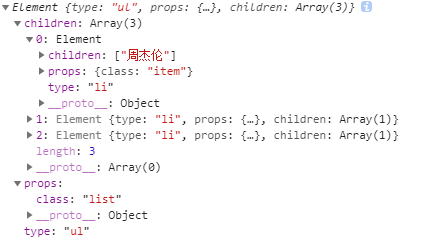
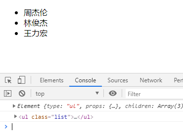
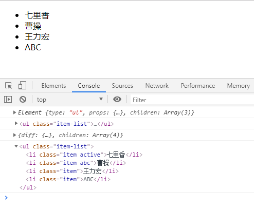

### 实现简单的DOM-Diff算法

#### 什么是虚拟DOM

**虚拟DOM**简而言之就是用JS去按照DOM结构来实现DOM的树形结构的对象，当然，由于真实的DOM有很多的属性接口，而我们在这里的虚拟DOM只描述真实DOM 的一部分属性。

#### 创建虚拟DOM
巧妇难为无米之炊，既然要实现DOM-Diff算法，那么我们肯定需要创建虚拟DOM，并且要知道虚拟DOM如何渲染成真实的DOM，

```javascript
// element.js

// 定义虚拟DOM的类
class Element {
  constructor(type, props, children) {
    this.type = type
    this.props = props
    this.children = children
  }
}

// 创建虚拟DOM
function createElement(type, props, children) {
  return new Element(type, props, children)
}
```
这里我们首先定义了用来描述虚拟DOM的类`Element`, Element里定义了三个属性: 

* type: 指定元素的标签类型，如'li', 'div', 'a'等
* props: 表示指定元素身上的属性，如class, style, 自定义属性等
* children: 表示指定元素是否有子节点，参数以数组的形式传入

接着我们定义了createElement函数来为我们创建虚拟DOM对象


接下来我们来测试一下能够成功创建虚拟DOM

```javascript
// index.js
let virtualDom = createElement('ul', {class: 'list'}, [
  createElement('li', {class: 'item'}, ['周杰伦']),
  createElement('li', {class: 'item'}, ['林俊杰']),
  createElement('li', {class: 'item'}, ['王力宏']),
])

console.log(virtualDom)

```



可以看到我们已经可以成功的创建虚拟DOM对象了，接下来我们就要将虚拟DOM渲染成真实DOM并挂载到页面中

```javascript
// element.js

...

// 将虚拟DOM转换为真实DOM
function render(vDom) {
  // 创建DOM元素
  let el = document.createElement(vDom.type)

  // 遍历虚拟DOM的props, 给真实DOM设置属性
  for (let key in vDom.props) {
    setAttr(el, key, vDom.props[key])
  }

  // 遍历子节点
  // 如果是虚拟DOM，则递归渲染
  // 否则则代表是文本节点，直接创建
  vDom.children.forEach(item => {
    let node = item instanceof Element ? render(item) : document.createTextNode(item)
    el.appendChild(node)
  })
  return el
}

// 将真实DOM添加到页面中
function renderDom(el, target) {
  target.appendChild(el)
}

// 设置DOM的属性
function setAttr(el, key, value) {
  switch(key) {
    case 'value': 
      // 如果 el 是 input或者textarea 就直接设置其value
      if (el.tagName.toLowerCase() === 'input' || el.tagName.toLowerCase() === 'textarea') {
        el.value = value
      }
      else {
        el.setAttribute(key, value)
      }
      break
    case 'style':
      el.style.cssText = value
    default:
      el.setAttribute(key, value)
  }
}
```

将虚拟DOM渲染成真实DOM的逻辑也比较简单，主要步骤就是创建节点→设置节点属性→添加子节点

接下来我们检验一下我们的函数能否正常运行

```javascript
// index.js

// 创建虚拟DOM
let virtualDom = createElement('ul', {class: 'list'}, [
  createElement('li', {class: 'item'}, ['周杰伦']),
  createElement('li', {class: 'item'}, ['林俊杰']),
  createElement('li', {class: 'item'}, ['王力宏']),
])

console.log(virtualDom)

// 将虚拟DOM渲染成真实DOM并添加到页面中
var el = render(virtualDom)
console.log(el)

renderDom(el, document.getElementById("app"))
```



可以看到虚拟DOM被成功地渲染成真实DOM并添加到页面中

#### DOM-Diff算法的实现

DOM-diff那一定要清楚其存在的意义，给定任意两棵树，采用**先序深度优先遍历**的算法找到最少的转换步骤

DOM-diff比较两个虚拟DOM的区别，也就是在比较两个对象的区别。

**作用:** DOM-diff 算法主要功能是收集新老两个节点之间的变化，然后根据节点的变化来更新DOM

```javascript
// diff.js
function diff(oldNode, newNode) {
  // 收集两个VDOM节点之间的不同

  // 递归比较两个虚拟DOM，将比较结果放入Pathes中
  let patches = walk(oldNode, newNode)

  return patches
}


function walk(oldNode, newNode) {
  let currentPatch = {} // 每一个DOM元素都有一个patch

  if (!newNode) {
    // 如果不存在newNode，说明该Node被移除
    currentPatch.diff = {type: 'REMOVE', oldNode}
  } else if(newNode && !oldNode) {
    // 说明是新结点
    currentPatch.diff = {type: 'ADD', newNode}
  } else if (isString(oldNode) && isString(newNode)) {
    // 如果是文本, 则判断文本是否一致
    if (oldNode !== newNode) {
      currentPatch.diff = {type: 'TEXT', newNode}
    }
  } else if (oldNode.type === newNode.type) {
    // 如果是虚拟DOM元素
    // 比较属性是否相同
    let attrDiff = diffAttr(oldNode.props, newNode.props)
    if (Object.keys(attrDiff).length > 0) {
      currentPatch.diff = {type: 'ATTR', attrDiff}
    } else {
      // 说明该元素的属性相同, 可以理解为node没有被修改
      currentPatch.diff = {}
    }
    // 比较子节点是否相同
    currentPatch.children = []
    diffChildren(oldNode.children, newNode.children, currentPatch.children)
  } else if(oldNode.type !== newNode.type) {
    // 否则说明节点被替换了
    currentPatch.diff = {type: 'REPLACE', newNode}
  } else {
    // 说明没有被修改, 添加一个空对象
    currentPatch.diff = {}
  }

  return currentPatch
}


function isString(obj) {
  return obj && typeof obj === 'string'
}

function diffAttr(oldAttrs, newAttrs) {
  let patch = {}
  // 新老属性是否相同
  for (let key in oldAttrs) {
    if (oldAttrs[key] !== newAttrs[key]) {
      patch[key] = newAttrs[key]
    }
  }

  // 老节点中没有但新结点中有的属性
  for (let key in newAttrs) {
    if (!oldAttrs.hasOwnProperty(key)) {
      patch[key] = newAttrs[key]
    }
  }

  return patch
}

function diffChildren(oldChildren, newChildren, childrenPatch) {
  // 比较子节点
  newChildren.forEach((item, i) => {
    childrenPatch.push(walk(oldChildren[i], item))
  })
}
```

虽然代码有点长，但还是可以挺好理解的，主要工作就是收集每个节点是否产生了变化，主要做了一下工作来得到两个节点的不同, 最终得到的patch的结构和虚拟DOM结构一样都是一个树状的结构

* 新的DOM节点不存在{type: 'REMOVE', index}

  ```javascript
  if (!newNode) {
      // 如果不存在newNode，说明该Node被移除
      currentPatch.diff = {type: 'REMOVE', oldNode}
    }
  ```

* 如果新结点存在，老节点不存在，则说明添加了新的节点

  ```javascript
  else if(newNode && !oldNode) {
      // 说明是新结点
     currentPatch.diff = {type: 'ADD', newNode}
  }
  ```

* 如果是文本节点，则比较文本的变化{type: 'TEXT', text: 1}

  ```javascript
  else if (isString(oldNode) && isString(newNode)) {
      // 如果是文本, 则判断文本是否一致
      if (oldNode !== newNode) {
        currentPatch.diff = {type: 'TEXT', newNode}
      }
    } 
  ```

* 当节点类型相同时，去看一下属性是否相同，然后判断子节点是否相同

  ```javascript
  else if (oldNode.type === newNode.type) {
      // 如果是虚拟DOM元素
      // 比较属性是否相同
      let attrDiff = diffAttr(oldNode.props, newNode.props)
      if (Object.keys(attrDiff).length > 0) {
        currentPatch.diff = {type: 'ATTR', attrDiff}
      } else {
        // 说明该元素的属性相同, 可以理解为node没有被修改
        currentPatch.diff = {}
      }
      // 比较子节点是否相同
      currentPatch.children = []
      diffChildren(oldNode.children, newNode.children, currentPatch.children)
    }
  ```

* 否则，直接采用替换模式{type: 'REPLACE', newNode}

  ```javascript
  else if(oldNode.type !== newNode.type) {
      // 否则说明节点被替换了
      currentPatch.diff = {type: 'REPLACE', newNode}
  }
  ```

* 最后将所有的变化收集起来

  ```javascript
  else {
      // 说明没有被修改, 添加一个空对象
      currentPatch.diff = {}
  }
  ```

#### 节点更新

```javascript
// patch.js
function patch(node, patch) {
  run(node, patch)
}

/**
 * 
 * @param {HTMLElement} node 节点
 * @param {Object} patches 节点之间的不同
 * @param {Number} index 节点树的第几层
 * @param {Number} i 该层的第几个节点
 */
function run(node, patch) {
  let childNodes = node.childNodes
  let patchChildren = patch.children
  // 先修改每个子节点
  for (let i = 0; i < childNodes.length; ++i) {
    run(childNodes[i], patchChildren[i])
  }
  
  // patcheChildren的长度大于childNodes的长度, 说明有添加了新的节点
  if (patchChildren && patchChildren.length && patchChildren.length > childNodes.length) {
    for (let i = childNodes.length; i < patchChildren.length; ++i) {
      doPatch(node, patchChildren[i])
    }
  }
  if (patch) {
    doPatch(node, patch)
  }
}

function doPatch(node, patch) {
  console.log(Object.keys(patch))
  if (Object.keys(patch).length > 0) {
    let { diff } = patch
    switch(diff.type) {
      case 'ADD':
        var newNode = diff.newNode
        newNode = newNode instanceof Element ? render(newNode) : document.createTextNode(newNode)
        node.appendChild(newNode)
        break
      case 'ATTR':
        for (let key in diff.attrDiff) {
          let value = diff.attrDiff[key]
          setAttr(node, key, value)
        }
        break
      case 'TEXT':
        node.textContent = diff.newNode
        break
      case 'REPLACE':
        var newNode = diff.newNode
        let replaceNode = newNode instanceof Element ? render(newNode) : document.createTextNode(newNode)
        node.parentNode.replaceNode(replaceNode, node)
        break
      case 'REMOVE':
        node.parentNode.removeChild(node)
        break
    }
  }
}
```

我们来分析一下patch都做了什么

patch内部只是简单的调用了run方法

run方法中做了两件事

* 深度优先当前节点子节点先对子节点进行修改
* 如果patch.children的长度大于当前节点的子节点的长度，说明添加了一个新的元素，调用doPatch方法将新添加的元素加入当前节点
* 然后调用doPatch方法对当前节点进行处理

doPatch方法主要是根据修改的类型对node节点进行处理

最后我们再来测试一下我们的函数能够正常的工作


```javascript
// index.js
// 创建虚拟DOM
let virtualDom = createElement('ul', {class: 'list'}, [
  createElement('li', {class: 'item'}, ['周杰伦']),
  createElement('li', {class: 'item'}, ['林俊杰']),
  createElement('li', {class: 'item'}, ['王力宏']),
])

console.log(virtualDom)

// 将虚拟DOM渲染成真实DOM并添加到页面中
var el = render(virtualDom)
console.log(el)
renderDom(el, document.getElementById("app"))

let virtualDom2 = createElement('ul', {class: 'item-list'}, [
  createElement('li', {class: 'item active'}, ['七里香']),
  createElement('li', {class: 'item abc'}, ['曹操']),
  createElement('li', {class: 'item'}, ['王力宏']),
  createElement('li', {class: 'item'}, ['ABC']),
])

let patches = diff(virtualDom, virtualDom2)
console.log(patches)
patch(el, patches)
console.log(el)


```



可以看到我们函数正常的运行了

#### 总结

我们来梳理一下整个**DOM-diff**的过程：

* 用JS对象模拟DOM（虚拟DOM）
* 把此虚拟DOM转成真实DOM并插入页面中（render）

* 如果有事件发生修改了虚拟DOM，比较两棵虚拟DOM树的差异，得到差异对象（diff）

* 把差异对象应用到真正的DOM树上（patch）

